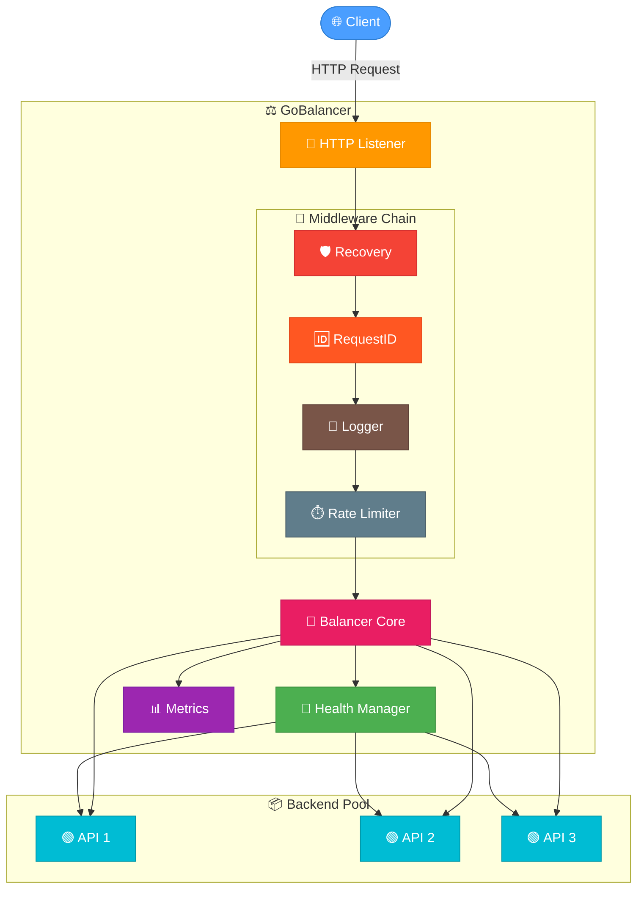
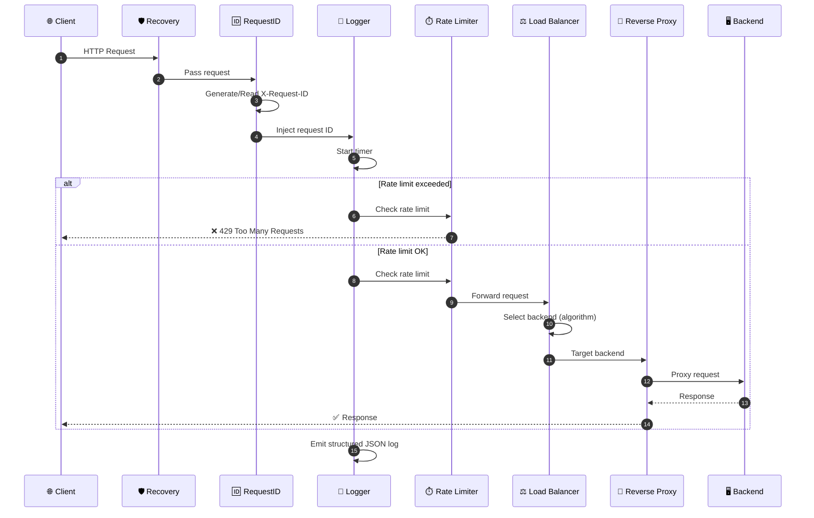
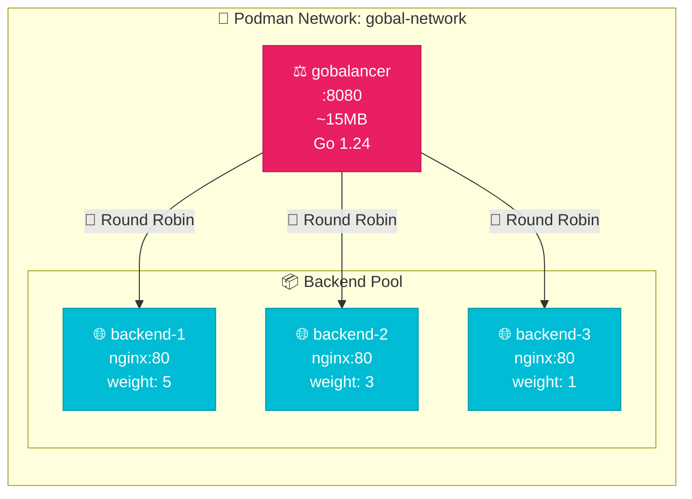

<div align="center">

# ⚖️ GoBalancer — L7 Load Balancer POC

[](https://go.dev/)
[](LICENSE)
[](#-testing)
[](https://podman.io/)
[](https://github.com/sergio11/gobalancer_poc)
[](https://github.com/sergio11/gobalancer_poc)

A proof-of-concept **L7 (HTTP/HTTPS) Load Balancer** built in Go, demonstrating load balancing algorithms, health checking, reverse proxying, rate limiting, structured logging, Prometheus-compatible metrics, dynamic configuration reload, and Podman-based automation — showcasing production-grade Go patterns in a self-contained project.

---

[📋 Disclaimer](#-disclaimer) · [🚀 Why Go?](#-why-go) · [🏗️ Architecture](#-architecture) · [✨ Features](#-features) · [⚙️ Configuration](#-configuration) · [🧪 Testing](#-testing) · [🎬 Demo](#-demo-with-podman-compose) · [📁 Project Structure](#-project-structure)

</div>

---

## 📋 Disclaimer

This project is developed for **educational and research purposes** only. It is intended to provide hands-on experience and deepen knowledge in **Go concurrency patterns**, **load balancing algorithms**, and **network infrastructure design**. It is **not designed** for deployment in production environments or real-world load balancer systems.

The primary focus is to explore **goroutine-based concurrency**, **interface-driven extensibility**, **Clean Architecture patterns**, and **standard library usage** for building network-oriented software, emphasizing developer learning and architectural exploration in a controlled environment.

---

## More Details 📝

For comprehensive information about this project, check out this [Medium article](https://medium.com/@sanchezsanchezsergio418/how-i-built-an-l7-load-balancer-in-go-algorithms-failover-and-the-complexity-of-shared-state-c00fcaa765dd).

## 🚀 Why Go?

Go was chosen as the language for this POC for several deliberate reasons that align with the requirements of network-oriented infrastructure software:

### ⚡ Performance and Concurrency

Go's goroutine-based concurrency model is ideal for a Load Balancer, where the runtime must handle thousands of concurrent connections efficiently. Each incoming request is served by a lightweight goroutine (a few KB of stack, managed by the Go runtime scheduler), allowing the balancer to sustain high throughput without the thread-per-connection overhead of traditional C/Java servers.

### 📦 Standard Library as First-Class Infrastructure

The `net/http` package provides a production-ready HTTP server with `ReadHeaderTimeout`, graceful shutdown, and context propagation — all without external dependencies. Similarly, `httputil.ReverseProxy` delivers connection pooling, chunked transfer encoding, and WebSocket upgrade support out of the box.

### 🔧 Single Binary Deployment

Go compiles to a static, platform-specific binary. Combined with `CGO_ENABLED=0`, the load balancer produces a single executable with no runtime dependencies, ideal for minimal container images. The multi-stage Dockerfile builds on `golang:1.24-alpine` and runs on a minimal `alpine:latest` base.

### 🧩 Interface-Driven Extensibility

Go's implicit interface satisfaction enables clean abstraction boundaries. The `Balancer` interface allows load balancing algorithms to be swapped without modifying callers. This is foundational to the algorithm engine and the testable architecture design.

---

## 💪 Strengths and Weaknesses

### ✅ Strengths

| Aspect | Detail |
|---|---|
| **Horizontal scalability** | Goroutines enable handling thousands of concurrent connections with ~2.5 KB stack each. No thread-per-connection overhead — scales linearly with CPU cores. |
| **Minimal resource footprint** | Binary: ~10 MB. Container: < 20 MB total (Alpine base). 10-20x smaller than Java/Python equivalents. |
| **Fast startup** | Cold start in < 50 ms, enabling rapid container orchestration and autoscaling. |
| **Compile-time safety** | Strong typing catches configuration and wiring errors at build time, not at 3 AM in production. |
| **Concurrency primitives** | Goroutines, channels, `sync.Mutex`, `sync.RWMutex`, and `sync/atomic` provide fine-grained control over concurrent state without external frameworks. |
| **Test coverage 98%+** | Automated unit and integration tests verify all load balancing algorithms, health checks, middleware, and proxy behavior. |
| **Production-ready patterns** | Health checking, graceful shutdown, rate limiting, structured logging, Prometheus metrics — all without external frameworks. |
| **Cross-compilation** | `GOOS=linux GOARCH=amd64 go build` produces a Linux binary from any development machine, including Windows. |
| **Pure Go** | Zero CGO dependencies simplifies cross-compilation, container builds, and CI pipelines. |

### ⚠️ Weaknesses / Tradeoffs

| Aspect | Detail |
|---|---|
| **In-memory state** | Backend pool and metrics are lost on restart. A production version would use Redis or similar for distributed state. |
| **Static routing** | No service discovery or dynamic route updates beyond YAML reload. Routes are loaded once at startup. |
| **Single-instance** | No clustering, no distributed rate limiting, no shared state across balancer nodes. |
| **No TLS termination** | The balancer serves plain HTTP. A production deployment would front it with a TLS terminator (e.g., nginx, Traefik, or cloud LB). |
| **No dependency injection framework** | All wiring is manual in `main()`. For a POC this is explicit and clear; at scale, tools like `wire` or `fx` reduce boilerplate. |
| **GC pauses** | Under extreme load (> 100k concurrent connections), garbage collector pauses may introduce latency spikes. |

---

## 🏗️ Design Decisions

### 🧱 Clean Architecture (`cmd` / `internal`)

The project follows Go community conventions for project layout:

- **`cmd/`** — Thin entrypoints that only wire dependencies and start servers. No business logic.
- **`internal/`** — All packages are unexportable, enforcing module boundaries. Each sub-package has a single responsibility.

This structure prevents circular dependencies, enforces clear ownership, and makes the codebase navigable for new contributors.

### 🔗 Middleware Chain Pattern

The balancer uses Go's idiomatic middleware pattern:

```go
type Middleware func(http.Handler) http.Handler

func Chain(h http.Handler, middlewares ...Middleware) http.Handler {
    for i := len(middlewares) - 1; i >= 0; i-- {
        h = middlewares[i](h)
    }
    return h
}
```

The request pipeline: **Recovery → RequestID → Logger → Rate Limiter → Load Balancer**. Each middleware is independently testable using `httptest.NewRequest` and `httptest.NewRecorder`.

### 🎯 Interface-Based Algorithm Engine (Strategy Pattern)

All algorithms implement a single `Balancer` interface:

```go
type Balancer interface {
    NextBackend(req *http.Request) (*backend.Backend, error)
}
```

The factory function `NewBalancer()` maps configuration strings to concrete implementations at startup. This avoids reflection-based loading, per-request interface assertions, and configuration parsing on every request. New algorithms can be added without modifying the rest of the system (Open/Closed Principle).

### 🔒 Thread-Safe Backend Pool

The `BackendPool` uses `sync.RWMutex` for concurrent read access and exclusive writes. Each `Backend` tracks its own state with `sync/atomic` operations:

- `Failures` / `Successes` — atomic counters for health check results
- `ActiveConnections` — atomic gauge for active connections
- `Latency` — atomic storage of last health check latency
- `Status` — protected by `sync.RWMutex` (HEALTHY/UNHEALTHY)

### 🛑 Graceful Shutdown

Uses `signal.NotifyContext` for `SIGINT`/`SIGTERM` handling. On shutdown, the server stops the health checker, drains in-flight requests, and calls `httpServer.Shutdown()` with a 10-second timeout.

---

## 🏛️ Architecture

### 📊 Component Diagram



### 🔄 Request Flow



---

## ✨ Features

### ⚖️ Load Balancing Algorithms

| Algorithm | Description |
|---|---|
| **Round Robin** | Cycles through backends sequentially (1 → 2 → 3 → 1 → ...). |
| **Least Connections** | Selects the backend with the fewest active connections. |
| **Weighted Round Robin** | Distributes traffic proportionally based on backend weights. |
| **Random** | Selects a backend at random. |
| **IP Hash** | Uses client IP to deterministically select a backend (session affinity). |

All algorithms are interchangeable via the `Balancer` interface — add a new one by implementing `NextBackend()`.

### 💓 Health Checking

Periodic health checks run in a background goroutine:

- **Configurable interval, timeout, and failure threshold**
- **Concurrent checks** — all backends are checked in parallel
- **Auto-recovery** — backends are automatically reincorporated when they respond again
- **Thread-safe** — uses atomic operations for failure/success counters

### 🔄 Reverse Proxy

Built on `httputil.ReverseProxy`. The custom `Director` function injects `X-Forwarded-For`, `X-Forwarded-Host`, and `X-Forwarded-Proto` headers. Connection pooling, chunked transfer, and WebSocket support are inherited from the standard library.

### ⏱️ Rate Limiting

Token bucket algorithm with:
- Per-IP bucket tracking with mutex protection
- Background eviction goroutine cleaning stale buckets (10-minute idle timeout)
- Configurable capacity and refill rate

### 🎛️ Admin API

| Endpoint | Method | Auth | Description |
|---|---|---|---|
| `/health` | GET | ❌ No | Balancer health status |
| `/api/backends` | GET | ✅ Basic Auth | List all backends with status, connections, latency |
| `/api/stats` | GET | ✅ Basic Auth | Aggregate stats (total, healthy, unhealthy) |
| `/api/reload` | POST | ✅ Basic Auth | Reload configuration without restart |
| `/metrics` | GET | ❌ No | Prometheus-compatible metrics |

> **Note:** Admin API endpoints (`/api/backends`, `/api/stats`, `/api/reload`) are protected by Basic Auth when `admin.secret` is configured in the YAML config. If the secret is empty, no authentication is required.

### 📊 Prometheus-Compatible Metrics

Exposed at `/metrics` in text format:

| Metric | Type | Labels | Description |
|---|---|---|---|
| `requests_total` | Counter | — | Total HTTP requests handled |
| `backend_errors_total` | Counter | — | Total backend errors |
| `active_connections` | Gauge | — | Active connections across all backends |
| `healthy_backends` | Gauge | — | Number of healthy backends |
| `unhealthy_backends` | Gauge | — | Number of unhealthy backends |
| `backend_latency_ms` | Gauge | `backend`, `url` | Last health check latency per backend |
| `backend_active_connections` | Gauge | `backend`, `url` | Active connections per backend |

### 📝 Structured Logging

JSON-structured logging with request ID correlation. Logs include method, path, client IP, status code, latency, backend ID, and matched route metadata.

### 🔄 Dynamic Configuration Reload

Modify the YAML config and call `POST /api/reload` — the balancer picks up new backends, algorithm changes, and health check settings without restarting.

### 🛑 Graceful Shutdown

Handles `SIGINT`/`SIGTERM` signals. On shutdown, the health checker stops, in-flight requests drain, and the HTTP server shuts down cleanly with a 10-second timeout.

---

## ⚙️ Configuration

### 📄 Configuration Reference

```yaml
server:
  port: 8080                    # Listen port (1-65535)
  logLevel: info                # Log level: debug | info | warn | error

loadBalancer:
  algorithm: round-robin        # round-robin | least-connections | weighted | random | ip-hash

healthCheck:
  interval: 5s                  # Health check interval
  timeout: 2s                   # Health check timeout
  maxFailures: 3                # Failures before marking UNHEALTHY

rateLimit:
  rate: 5000                    # Requests per second refill rate
  capacity: 10000               # Maximum burst capacity
  enabled: true                 # Enable/disable rate limiting
  trustForwardedHeaders: false  # Trust X-Forwarded-For / X-Real-IP headers

admin:
  secret: ""                    # Basic Auth password for admin API (empty = no auth)

backends:
  - url: http://localhost:9001  # Backend URL
    weight: 5                   # Weight for weighted algorithms
  - url: http://localhost:9002
    weight: 3
  - url: http://localhost:9003
    weight: 1
```

### 🔧 Supported Algorithms

| Config Value | Aliases |
|---|---|
| `round-robin` | `roundrobin`, `""` (default) |
| `least-connections` | `leastconnections`, `least_conn` |
| `weighted-round-robin` | `weighted`, `wrr` |
| `random` | — |
| `ip-hash` | `iphash` |

---

## 🧪 Testing

### ▶️ Run all tests

```bash
rake test
```

Runs unit and integration tests with coverage (enforcing a **98% minimum coverage threshold**), E2E integration tests, and **race condition detection** via `go test -race` on both suites.

### 🏃 Run race detector checks

```bash
rake test:race
```

Runs unit and E2E suites with the Go race detector enabled to catch data races in the concurrent code paths.

### 🔬 Run E2E tests

The `rake test` task runs the end-to-end integration tests using the Podman socket (DOCKER_HOST) inside a containerized Go environment.

### 🔨 Build binary

```bash
rake build
```

### 🧹 Clean artifacts

```bash
rake clean
```

---

## 🎬 Demo with Podman-Compose

Interactive demonstration of the L7 Load Balancer running in containers, showcasing Go concurrency patterns and goroutine efficiency.

### 🚀 Quick start

```bash
rake demo          # Build + start + run interactive demo
rake demo:stop     # Stop and remove containers
```

### 📋 Demo phases

1. **Round Robin**: Cyclic distribution across 3 backends (1→2→3→1...)
2. **Weighted Round Robin**: Proportional distribution (weight 5:3:1)
3. **Health Check + Failover**: Backend failure detection and traffic rerouting
4. **Metrics**: Prometheus-compatible metrics and admin API
5. **Why Go?**: Goroutines vs threads comparison

### 🏗️ Architecture



---

## 📁 Project Structure

```
.
├── cmd/
│   └── gobalancer/
│       └── main.go                 # Entrypoint: wiring, server, graceful shutdown
├── internal/
│   ├── api/
│   │   ├── handler.go              # Admin API handlers (backends, stats, reload, health)
│   │   ├── handler_test.go
│   │   └── handler_extra_test.go
│   ├── backend/
│   │   ├── backend.go              # Backend model (atomic counters, status)
│   │   ├── pool.go                 # Thread-safe BackendPool
│   │   ├── backend_test.go
│   │   ├── backend_extra_test.go
│   │   └── pool_test.go
│   ├── balancer/
│   │   ├── balancer.go             # Balancer interface + factory
│   │   ├── round_robin.go          # Round Robin algorithm
│   │   ├── least_connections.go    # Least Connections algorithm
│   │   ├── weighted.go             # Weighted Round Robin algorithm
│   │   ├── random.go               # Random algorithm
│   │   ├── ip_hash.go              # IP Hash algorithm
│   │   ├── balancer_test.go
│   │   ├── balancer_extra_test.go
│   │   └── random_factory_test.go
│   ├── config/
│   │   ├── config.go               # YAML config loader
│   │   ├── config_test.go
│   │   └── config_extra_test.go
│   ├── health/
│   │   ├── checker.go              # Periodic health checker
│   │   ├── checker_test.go
│   │   └── checker_extra_test.go
│   ├── httputil/
│   │   ├── httputil.go             # HTTP utilities (GetClientIP)
│   │   └── httputil_test.go
│   ├── logger/
│   │   ├── logger.go               # Structured JSON logger
│   │   └── logger_test.go
│   ├── metrics/
│   │   ├── metrics.go              # Prometheus-compatible metrics
│   │   └── metrics_test.go
│   ├── middleware/
│   │   ├── middleware.go            # Chain() + Middleware type
│   │   ├── recovery.go             # Panic recovery
│   │   ├── request_id.go           # X-Request-ID generation
│   │   ├── logger.go               # Request logging
│   │   ├── rate_limiter.go         # Token bucket rate limiter
│   │   ├── middleware_test.go
│   │   ├── middleware_extra_test.go
│   │   └── middleware_logger_test.go
│   └── proxy/
│       ├── proxy.go                # Reverse proxy wrapper
│       └── proxy_test.go
├── demo/
│   ├── podman-compose.yml          # Container orchestration
│   ├── Dockerfile.lb               # Multi-stage Go LB build
│   ├── backend/
│   │   ├── Dockerfile              # nginx backend
│   │   └── nginx.conf              # Health endpoint config
│   ├── configs/
│   │   ├── config-roundrobin.yaml  # Round Robin config
│   │   ├── config-weighted.yaml    # Weighted RR config
│   │   └── config-leastconn.yaml   # Least Connections config
│   └── backends/
│       ├── backend-1/index.html    # Backend 1 page
│       ├── backend-2/index.html    # Backend 2 page
│       └── backend-3/index.html    # Backend 3 page
├── configs/
│   └── config.yaml                 # Default configuration
├── test/
│   └── e2e/
│       ├── e2e_test.go             # E2E test suite entry
│       ├── e2e_balancers_test.go   # E2E balancer algorithm tests
│       ├── e2e_middleware_test.go  # E2E middleware tests
│       ├── e2e_admin_metrics_test.go # E2E admin/metrics tests
│       ├── e2e_resilience_test.go  # E2E resilience tests
│       └── harness_test.go         # E2E test harness/helpers
├── .editorconfig                   # Editor configuration
├── .gitignore                      # Git ignore rules
├── Dockerfile                      # Multi-stage container build
├── Rakefile                        # Build automation (test, build, clean, demo)
├── go.mod                          # Go 1.24 module definition
├── go.sum                          # Go dependency checksums
├── LICENSE                         # MIT
├── MEDIUM_ARTICLE.md               # Full article about the project
└── README.md                       # This file
```

---

## 🔄 Reproduce Results

```bash
# Run tests with coverage
rake test

# Run E2E tests
rake test:e2e

# Build binary
rake build

# Clean artifacts
rake clean
```

---

## 📄 License

This is a Proof of Concept. Not intended for production use.

This project is licensed under the MIT License, an open-source software license that allows developers to freely use, copy, modify, and distribute the software. This includes use in both personal and commercial projects, with the only requirement being that the original copyright notice is retained.

Please note the following limitations:

- The software is provided "as is", without any warranties, express or implied.
- If you distribute the software, whether in original or modified form, you must include the original copyright notice and license.
- The license allows for commercial use, but you cannot claim ownership over the software itself.

The goal of this license is to maximize freedom for developers while maintaining recognition for the original creators.

```
MIT License

Copyright (c) 2026 Sergio Sanchez

Permission is hereby granted, free of charge, to any person obtaining a copy
of this software and associated documentation files (the "Software"), to deal
in the Software without restriction, including without limitation the rights
to use, copy, modify, merge, publish, distribute, sublicense, and/or sell
copies of the Software, and to permit persons to whom the Software is
furnished to do so, subject to the following conditions:

The above copyright notice and this permission notice shall be included in all
copies or substantial portions of the Software.

THE SOFTWARE IS PROVIDED "AS IS", WITHOUT WARRANTY OF ANY KIND, EXPRESS OR
IMPLIED, INCLUDING BUT NOT LIMITED TO THE WARRANTIES OF MERCHANTABILITY,
FITNESS FOR A PARTICULAR PURPOSE AND NONINFRINGEMENT. IN NO EVENT SHALL THE
AUTHORS OR COPYRIGHT HOLDERS BE LIABLE FOR ANY CLAIM, DAMAGES OR OTHER
LIABILITY, WHETHER IN AN ACTION OF CONTRACT, TORT OR OTHERWISE, ARISING FROM,
OUT OF OR IN CONNECTION WITH THE SOFTWARE OR THE USE OR OTHER DEALINGS IN THE
SOFTWARE.
```

---

<div align="center">

**Built with ❤️ using Go 1.24**

[⬆️ Back to Top](#-gobalancer--l7-load-balancer-poc)

</div>
